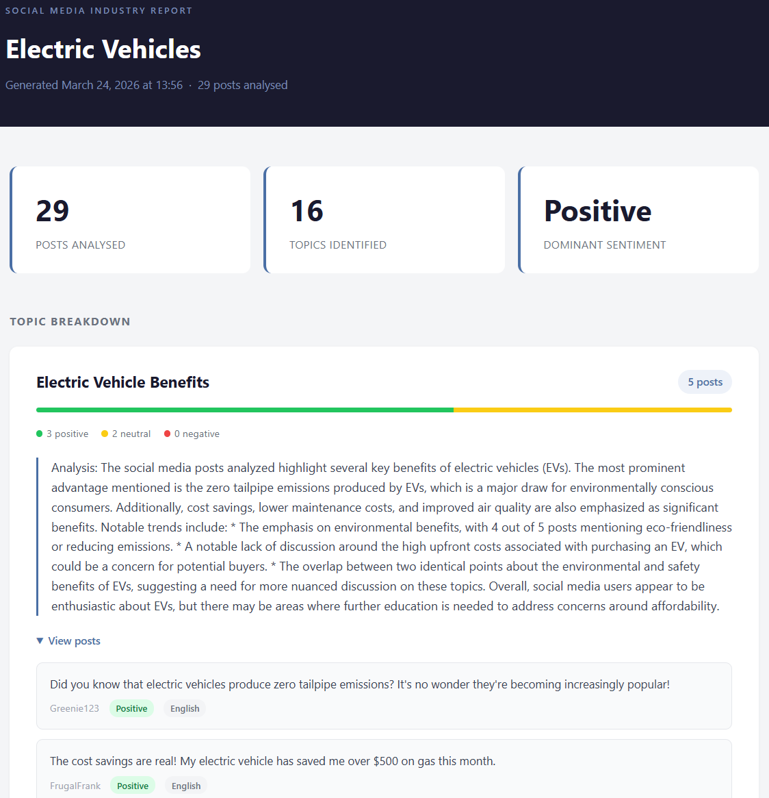

# ETL Pipeline

A local ETL pipeline that generates a social media industry report using a locally-hosted LLM.

Given a topic and post count, the pipeline:
1. **Generates** synthetic social media posts via LLM
2. **Extracts** posts from disk into memory
3. **Transforms** them — tagging each post by topic and sentiment, merging similar topics, then summarising each cluster
4. **Loads** the result into a self-contained HTML report

All LLM inference runs locally via [Ollama](https://ollama.com) — no API keys or cloud services required.



## Prerequisites

- [Ollama](https://ollama.com) installed and running
- [uv](https://docs.astral.sh/uv/) installed
- The `llama3.1:8b` model pulled:

```bash
ollama pull llama3.1:8b
```

## Setup

```bash
git clone https://github.com/teddywinglee/ETL-practice-with-claude
cd ETL-practice-with-claude
uv sync
```

## Usage

### Full run (generate + ETL in one step)

```bash
uv run run_all.py --count 20 --theme "electric vehicles"
uv run run_all.py --count 30 --theme "healthcare policy" --languages "English,Mandarin,Spanish"
```

### Or run stages separately

```bash
# Step 1 — generate posts into data/posts.jsonl
uv run generate.py --count 20 --theme "electric vehicles" --languages "English,Spanish"

# Step 2 — run the ETL pipeline on whatever is in data/posts.jsonl
uv run main.py --theme "electric vehicles"
```

Running stages separately is useful when iterating on the transform or report — regenerating posts each time is slow.

| Flag | Script | Description |
|---|---|---|
| `--count` | `generate.py`, `run_all.py` | Number of posts to generate |
| `--theme` | all | Topic for posts / report title |
| `--languages` | `generate.py`, `run_all.py` | Comma-separated languages, e.g. `English,Mandarin,Spanish` |

The report is saved to `output/report_<timestamp>.html`.

## Project Structure

```
ETL-practice-with-claude/
├── generate.py          # Standalone: generate posts → data/posts.jsonl
├── main.py              # Standalone: run ETL on existing data/posts.jsonl
├── run_all.py           # Convenience: generate + ETL in one step
├── pipeline/
│   ├── generate.py      # LLM generates synthetic posts → JSONL
│   ├── extract.py       # Load JSONL into memory
│   ├── transform.py     # Tag posts, merge topics, summarise clusters
│   └── load.py          # Render HTML report via Jinja2
├── templates/
│   └── report.html      # Jinja2 report template
├── examples/            # Sample input and output (no need to run)
│   ├── posts_sample.jsonl
│   └── report_sample.html
├── data/                # Generated JSONL (git-ignored)
└── output/              # Generated HTML reports (git-ignored)
```

## Design Notes

See [DEVELOPMENT.md](DEVELOPMENT.md) for architectural decisions, design tradeoffs, and notes on the development process.

## How the Transform Stage Works

Each post is tagged individually with a free-form topic label and sentiment (`positive` / `neutral` / `negative`). A second LLM pass consolidates similar topic labels into canonical clusters. Each cluster is then summarised analytically. This mirrors how production social media analytics pipelines are typically structured — a per-document map step followed by a reduce/summarise step.

For multilingual datasets, topic labels and summaries are always produced in English. The original post text is preserved in its source language in the report.
